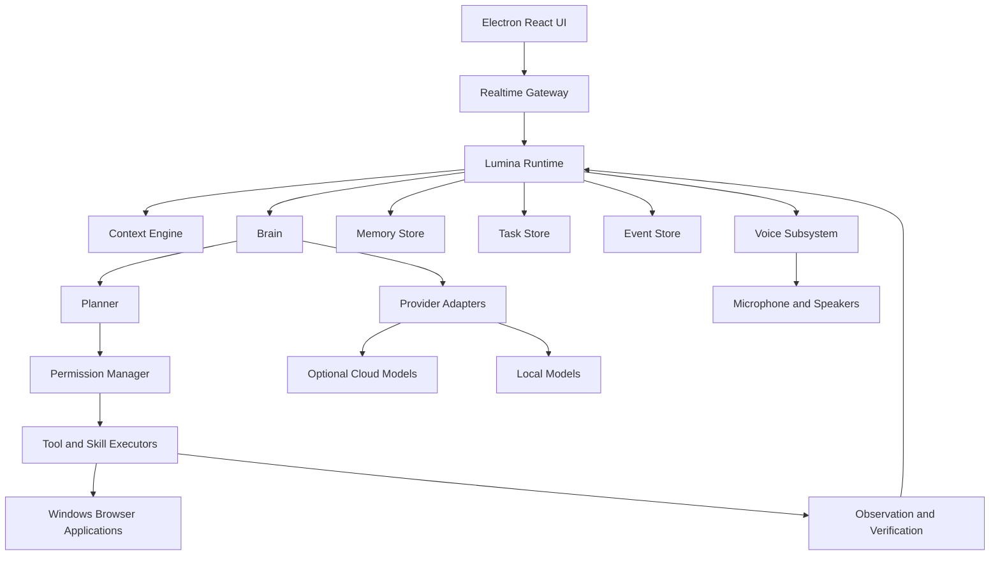
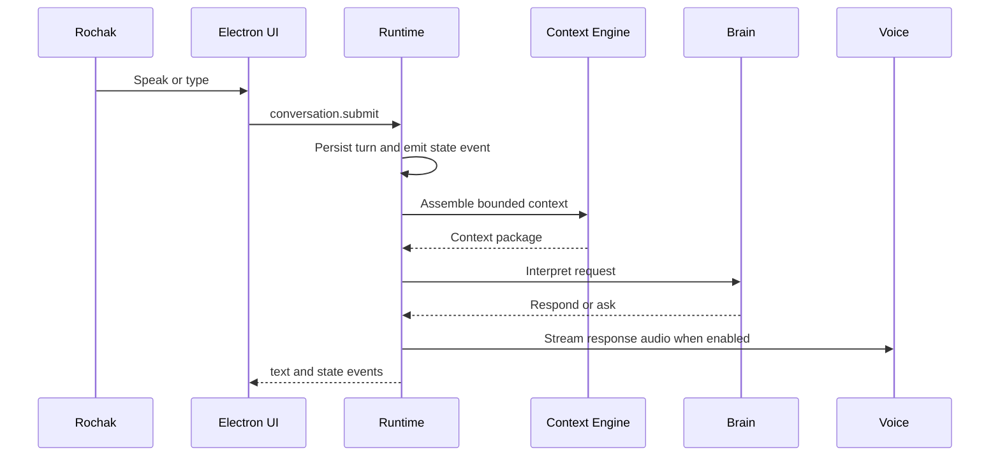
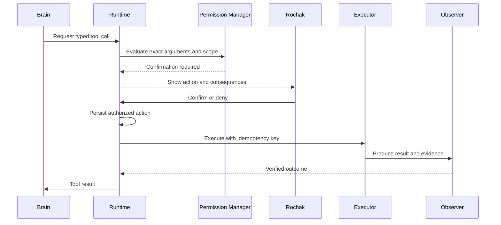
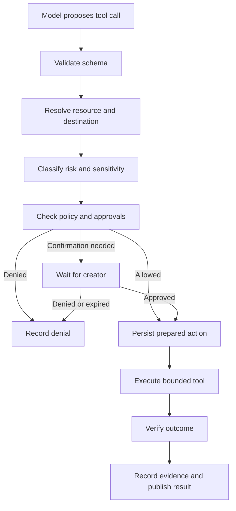

# Lumina System Design Document

**Document:** 2 — System Design
**Product:** Lumina
**Creator:** Rochak Adhikari (Scepter)
**Version:** 1.0
**Date:** 2 October 2026
**Status:** Engineering baseline

## 1. Purpose

This document defines how Lumina should be built from the requirements in Document 1. It converts the product vision into a concrete, modular, testable and recoverable system design.

Lumina is a Windows-first, local-first, voice-first personal AI operating layer. The initial product has one user: Rochak Adhikari (Scepter). The system must support natural conversation, contextual memory, task planning, authorized tools, computer interaction, controlled proactivity and reviewed skill extensions.

The design has one governing rule:

> The model may propose intent, plans and tool calls. The runtime owns state, permissions, execution, persistence, recovery and auditability.

## 2. Design goals and constraints

### 2.1 Goals

- Keep the core understandable to a developer who did not create it.
- Make the central runtime usable without the Electron UI or a live model.
- Make voice responsive, interruptible and recoverable.
- Keep essential local capabilities available when the network is unavailable.
- Make model providers, voices, tools, skills and avatars replaceable.
- Make every meaningful action inspectable after it happens.
- Avoid adding distributed infrastructure before a measured need exists.
- Support controlled evolution without allowing generated code to redefine trust boundaries.

### 2.2 Constraints

- Operating system: Windows-first.
- Initial user: Rochak Adhikari (Scepter) only.
- Existing project direction: Python runtime with Electron and React UI.
- Reference hardware: Windows 11, RTX 4060 8 GB, Ryzen 5 3500, 16 GB DDR4.
- Existing legacy system: use only as reference; the new Lumina implementation remains separate.
- Cost preference: use free and local tools where practical; cloud services are optional and visible.
- No production claim may be made from unit tests alone.

### 2.3 Architectural rules

1. Security, permissions and state transitions are deterministic runtime code.
2. Every external side effect is represented as an authorized action record.
3. Every long-running operation is cancellable, bounded and recoverable.
4. Every model response is untrusted until parsed and validated.
5. Untrusted web, document, message and clipboard content is data, never authority.
6. Memory retrieval is selective; the entire history is never injected by default.
7. A failed action and an action with unknown outcome are different states.
8. Modules communicate through typed interfaces and versioned events.
9. The simplest design that passes the acceptance criteria is preferred.

## 3. System overview



The first implementation should use a small number of processes:

1. **Electron renderer** — visual UI.
2. **Electron main process** — desktop lifecycle and secure bridge.
3. **Python runtime process** — authoritative orchestration and persistence.
4. **Optional worker processes** — isolated tools, local model inference or skill execution when required.

Do not split every module into a network service. Brain, Planner, Context, Memory, Tasks and Permissions can begin as modules inside the runtime process.

## 4. Process and module boundaries

### 4.1 Electron renderer

Responsibilities:

- Render conversation, transcript, activity and task views.
- Render avatar and state indicators.
- Display approval prompts and cancellation controls.
- Display memory and audit details that the creator is allowed to inspect.
- Send user intents through the secure desktop bridge.
- Subscribe to authoritative runtime events.

The renderer must not:

- Hold provider API keys.
- Execute arbitrary operating-system commands.
- Decide whether a tool call is allowed.
- Maintain an independent copy of authoritative task state.
- Treat a UI button click as proof that an action completed.

### 4.2 Electron main process

Responsibilities:

- Create and manage the desktop window.
- Manage application startup, shutdown, tray behavior and notifications.
- Host a narrow, validated IPC bridge.
- Manage microphone and speaker device discovery when the desktop API owns the devices.
- Enforce renderer isolation and secure navigation policy.
- Start, stop and monitor the Python runtime process.

The main process should not become a second brain. It forwards typed commands and events.

### 4.3 Realtime gateway

Responsibilities:

- Authenticate the local desktop client.
- Validate incoming command envelopes.
- Forward commands to the runtime.
- Stream versioned events to subscribed clients.
- Apply connection sequencing, heartbeats and reconnect behavior.

The gateway may use WebSocket or Socket.IO. The protocol must be documented independently of the library.

### 4.4 Lumina runtime

The runtime owns:

- Conversation sessions.
- State machine and event ordering.
- Brain and Planner coordination.
- Context assembly.
- Tool authorization and dispatch.
- Task persistence and recovery.
- Memory lifecycle.
- Skill lifecycle.
- Provider routing.
- Observability and audit records.
- Shutdown and restart reconciliation.

The runtime is the only component allowed to move an action from proposed to authorized to running.

### 4.5 Brain

The Brain is provider-neutral. It receives a bounded context and returns typed decisions:

- `Respond` — answer without a tool.
- `AskClarification` — request missing information.
- `CreatePlan` — create a plan for a task.
- `RequestTool` — request one tool call.
- `CompleteTask` — provide a completion explanation tied to evidence.
- `ReportUncertainty` — state that available evidence is insufficient.

The Brain cannot directly import filesystem, subprocess, browser-control or credential modules.

### 4.6 Planner

The Planner turns a goal into a bounded plan:

- Goal.
- Constraints.
- Steps.
- Dependencies.
- Risk classification.
- Completion criteria.
- Verification steps.
- Maximum iteration count.
- Cancellation behavior.

The Planner must support direct execution for simple tasks. It must not create a multi-step plan for every greeting or factual question.

### 4.7 Context Engine

The Context Engine assembles model input from:

- Current conversation turns.
- Current task and plan.
- Relevant memory records.
- Live environment state.
- Relevant skill manifests.
- Verified tool results.
- Creator preferences and current mode.

Every context item has a source, trust classification, timestamp and token budget cost. Tool results and untrusted documents are marked as data. They cannot alter system rules.

### 4.8 Memory service

The Memory service owns:

- Creation, retrieval, correction, merge and invalidation.
- User inspection and deletion.
- Scope and lifecycle policy.
- Embedding/index synchronization.
- Memory provenance.

The vector index is a retrieval accelerator. It is not the system of record.

### 4.9 Task manager

The Task Manager owns:

- Task creation and status transitions.
- Plan checkpoints.
- Active-step tracking.
- Pause, resume and cancel behavior.
- Retry classification.
- Recovery after restart.
- Completion verification.

### 4.10 Permission manager

The Permission Manager evaluates every proposed tool call against policy and scope. It must be deterministic and testable without an LLM.

Inputs include:

- User identity.
- Tool identity and version.
- Operation and arguments.
- Resource and destination.
- Data sensitivity.
- Risk level.
- Reversibility.
- Current task.
- Existing approvals.
- Expiry and revocation state.

### 4.11 Tool and skill executors

Executors perform actions only after runtime authorization. They return structured evidence and never silently reinterpret arguments.

Potential executor families:

- Filesystem executor.
- System diagnostics executor.
- Process and application executor.
- Browser executor.
- Computer-use executor.
- Web research executor.
- Document executor.
- Local model executor.
- Notification executor.

## 5. Runtime state machine

### 5.1 Dialogue and execution state

Lumina has overlapping but separate state domains:

| Domain | States |
|---|---|
| Dialogue | `IDLE`, `LISTENING`, `THINKING`, `WAITING_FOR_USER`, `ERROR` |
| Audio output | `SILENT`, `BUFFERING`, `SPEAKING`, `STOPPING`, `INTERRUPTED` |
| Task execution | `NONE`, `PLANNING`, `WAITING_APPROVAL`, `EXECUTING`, `PAUSED`, `CANCELLING`, `RECOVERING`, `COMPLETED`, `FAILED`, `UNKNOWN_OUTCOME` |

The UI may present a combined state such as “Thinking” or “Executing,” but the runtime retains the underlying domains.

### 5.2 State transition rules

- A user interruption always stops current audio output.
- Audio interruption does not automatically cancel a background task.
- A task cancellation request transitions to `CANCELLING`; completion requires executor acknowledgement or a timeout outcome.
- A crash during an external action produces `UNKNOWN_OUTCOME` unless evidence proves failure.
- A state transition emits one event with a monotonic sequence number.
- Invalid transitions are rejected and logged.

### 5.3 Cancellation scopes

Support separate scopes:

1. `STOP_SPEECH` — stop only current playback and synthesis.
2. `CANCEL_RESPONSE` — stop response generation and playback.
3. `CANCEL_STEP` — stop the current tool step where possible.
4. `CANCEL_TASK` — stop the current task and record partial effects.
5. `EMERGENCY_STOP` — stop speech, block new execution and attempt to stop all active tools.

## 6. Core data contracts

All internal and external payloads should be versioned. JSON examples below are illustrative contracts.

### 6.1 Command envelope

```json
{
  "schema_version": 1,
  "command_id": "cmd_01J...",
  "type": "conversation.submit",
  "created_at": "2026-10-02T12:30:00Z",
  "session_id": "session_01J...",
  "payload": {
    "input_type": "voice",
    "text": "Organize my downloads folder",
    "audio_reference": null
  }
}
```

### 6.2 Event envelope

```json
{
  "schema_version": 1,
  "event_id": "evt_01J...",
  "sequence": 1842,
  "type": "tool.completed",
  "occurred_at": "2026-10-02T12:30:04Z",
  "correlation_id": "task_01J...",
  "causation_id": "toolcall_01J...",
  "payload": {},
  "redaction": {
    "applied": true,
    "fields": ["credential_value"]
  }
}
```

### 6.3 Tool manifest

```json
{
  "name": "filesystem.move",
  "version": "1.0.0",
  "description": "Move files within an approved local scope",
  "input_schema": {},
  "output_schema": {},
  "permissions": {
    "risk_level": 1,
    "requires_confirmation": true,
    "data_access": "local_files"
  },
  "runtime": {
    "timeout_ms": 30000,
    "supports_cancellation": true,
    "idempotency": "operation_key",
    "reconciliation": "scan_destination_and_source"
  }
}
```

### 6.4 Brain decision

```json
{
  "decision_type": "request_tool",
  "confidence": 0.91,
  "reason_summary": "The user requested a bounded file operation",
  "tool_name": "filesystem.move",
  "arguments": {},
  "requires_clarification": false
}
```

The `reason_summary` is an operational explanation, not a promise that hidden model reasoning is exposed.

## 7. API structure

The API is internal-first. It may be exposed over localhost to the desktop client, but it must still authenticate clients and validate commands.

### 7.1 Command endpoints

| Endpoint | Purpose |
|---|---|
| `POST /api/v1/conversation/messages` | Submit text or a completed speech turn. |
| `POST /api/v1/conversation/interrupt` | Stop current speech or response generation. |
| `POST /api/v1/conversation/confirm` | Confirm a specific pending action. |
| `POST /api/v1/conversation/deny` | Deny a specific pending action. |
| `POST /api/v1/tasks` | Create a task explicitly. |
| `POST /api/v1/tasks/{task_id}/pause` | Pause a resumable task. |
| `POST /api/v1/tasks/{task_id}/resume` | Resume a paused or recoverable task. |
| `POST /api/v1/tasks/{task_id}/cancel` | Cancel a task. |
| `POST /api/v1/tasks/{task_id}/retry` | Retry only a classified retryable failure. |
| `GET /api/v1/tasks` | List tasks with filters. |
| `GET /api/v1/tasks/{task_id}` | Retrieve task state, plan and evidence. |
| `GET /api/v1/events` | Read event history with cursor pagination. |
| `GET /api/v1/events/stream` | Subscribe to realtime events. |

### 7.2 Memory endpoints

| Endpoint | Purpose |
|---|---|
| `GET /api/v1/memory` | List inspectable memories. |
| `POST /api/v1/memory/search` | Search relevant memories. |
| `GET /api/v1/memory/{memory_id}` | View content, provenance and lifecycle. |
| `PATCH /api/v1/memory/{memory_id}` | Correct content or metadata. |
| `POST /api/v1/memory/{memory_id}/invalidate` | Mark a memory invalid. |
| `DELETE /api/v1/memory/{memory_id}` | Delete according to retention policy. |
| `POST /api/v1/memory/export` | Export creator-readable memory data. |

### 7.3 Tool and skill endpoints

| Endpoint | Purpose |
|---|---|
| `GET /api/v1/tools` | List available tools and capability status. |
| `GET /api/v1/tools/{tool_name}` | View manifest and permissions. |
| `POST /api/v1/tools/{tool_name}/dry-run` | Validate and preview an action without side effect. |
| `GET /api/v1/skills` | List installed, disabled and available skills. |
| `POST /api/v1/skills/proposals` | Create a capability proposal. |
| `POST /api/v1/skills/install` | Install a reviewed package. |
| `POST /api/v1/skills/{skill_id}/validate` | Validate manifest, dependencies and contracts. |
| `POST /api/v1/skills/{skill_id}/enable` | Enable a validated skill. |
| `POST /api/v1/skills/{skill_id}/disable` | Disable a skill. |
| `POST /api/v1/skills/{skill_id}/rollback` | Restore a compatible prior version. |

### 7.4 System and settings endpoints

| Endpoint | Purpose |
|---|---|
| `GET /api/v1/system/health` | Runtime and dependency health. |
| `GET /api/v1/system/resources` | CPU, GPU, RAM, VRAM, disk and queue status. |
| `GET /api/v1/system/devices` | Microphone and speaker inventory. |
| `POST /api/v1/system/devices/select` | Select input or output devices. |
| `GET /api/v1/settings` | Read validated settings. |
| `PATCH /api/v1/settings` | Update settings with version checks. |
| `GET /api/v1/permissions` | Inspect effective permissions and approvals. |
| `POST /api/v1/permissions/revoke` | Revoke a standing approval or skill capability. |
| `POST /api/v1/emergency-stop` | Stop active output and block new actions. |

### 7.5 API response envelope

```json
{
  "schema_version": 1,
  "request_id": "req_01J...",
  "status": "accepted",
  "data": {},
  "error": null,
  "next_cursor": null
}
```

Errors must use stable codes such as:

- `AUTH_REQUIRED`
- `INVALID_COMMAND`
- `STALE_VERSION`
- `PERMISSION_REQUIRED`
- `PERMISSION_DENIED`
- `CONFIRMATION_EXPIRED`
- `TOOL_UNAVAILABLE`
- `TOOL_TIMEOUT`
- `TOOL_CANCELLED`
- `OUTCOME_UNKNOWN`
- `RESOURCE_LIMIT`
- `PROVIDER_UNAVAILABLE`
- `VALIDATION_FAILED`
- `RECOVERY_REQUIRED`

## 8. Main API flows

### 8.1 Conversation to answer



### 8.2 Tool action with approval



### 8.3 Interrupting speech

1. User speech detector identifies barge-in.
2. Voice subsystem emits `user.speech_started`.
3. Runtime sends cancellation to playback and synthesis.
4. Current response token is invalidated.
5. Audio queue is cleared.
6. Late chunks with the old response token are discarded.
7. Runtime processes the new utterance.
8. The underlying task continues or cancels according to its separate scope.

### 8.4 Adaptive task loop

1. Create task and persist goal.
2. Generate a bounded plan.
3. Validate plan structure and risk.
4. Authorize the next step.
5. Execute one step with timeout and cancellation.
6. Record observation and evidence.
7. Verify completion criteria.
8. Complete, ask, re-plan, pause or fail.
9. Stop at maximum steps, deadline or resource limit.

### 8.5 Restart recovery

1. Runtime starts in `RECOVERING`.
2. Load incomplete tasks, action records, event cursor and pending approvals.
3. Reconcile actions that were running at shutdown.
4. Mark external actions as `UNKNOWN_OUTCOME` when evidence is missing.
5. Resume only safe and idempotent steps.
6. Ask Rochak about ambiguous or high-risk recovery.
7. Publish a recovery summary to the UI.
8. Enter normal operation after reconciliation completes.

## 9. Database and storage design

### 9.1 Storage responsibilities

| Store | System of record for |
|---|---|
| SQLite | Conversations, tasks, plans, action records, memories, events, settings, skills and permissions. |
| Vector index | Embeddings and semantic retrieval index; rebuildable from SQLite. |
| Filesystem | Audio artifacts when retained, documents, screenshots, skill packages and exports. |
| Secure OS credential store | Provider keys and secrets, never ordinary SQLite plaintext. |

SQLite should be the initial source of truth. Use WAL mode, transactions and migrations. Keep database writes serialized through a repository layer.

### 9.2 Core schema

The following is a logical schema. Exact SQL types and indexes may evolve during implementation, but these relationships must remain explicit.

#### `conversations`

| Column | Type | Notes |
|---|---|---|
| `id` | text | Primary key. |
| `title` | text nullable | Generated or creator-edited label. |
| `mode` | text | Companion, Work, Developer or Serious. |
| `status` | text | Active, archived or deleted. |
| `created_at` | timestamp | Creation time. |
| `updated_at` | timestamp | Last activity. |

#### `messages`

| Column | Type | Notes |
|---|---|---|
| `id` | text | Primary key. |
| `conversation_id` | text | Foreign key. |
| `role` | text | User, assistant, tool or system. |
| `content` | text | Redacted or encrypted according to policy. |
| `input_type` | text | Text, voice, notification or internal. |
| `source` | text | Creator, provider, tool, memory or runtime. |
| `created_at` | timestamp | Ordering source. |
| `response_id` | text nullable | Groups streamed response chunks. |
| `metadata_json` | json | Language, confidence and redaction metadata. |

#### `tasks`

| Column | Type | Notes |
|---|---|---|
| `id` | text | Primary key. |
| `conversation_id` | text nullable | Originating conversation. |
| `goal` | text | Creator goal. |
| `status` | text | Proposed, planning, waiting approval, executing, paused, recovering, completed, failed, cancelled or unknown. |
| `priority` | integer | Scheduling priority. |
| `deadline_at` | timestamp nullable | Optional deadline. |
| `completion_criteria_json` | json | Machine-checkable criteria where possible. |
| `current_step_id` | text nullable | Active plan step. |
| `created_at` | timestamp | Creation time. |
| `updated_at` | timestamp | Last change. |

#### `task_plans`

| Column | Type | Notes |
|---|---|---|
| `id` | text | Primary key. |
| `task_id` | text | Foreign key. |
| `version` | integer | Plan version. |
| `steps_json` | json | Ordered steps and dependencies. |
| `constraints_json` | json | Limits and assumptions. |
| `verification_json` | json | Verification instructions. |
| `created_by` | text | Brain, creator or recovery. |
| `created_at` | timestamp | Creation time. |

#### `task_steps`

| Column | Type | Notes |
|---|---|---|
| `id` | text | Primary key. |
| `task_id` | text | Foreign key. |
| `plan_id` | text | Foreign key. |
| `step_index` | integer | Stable ordering. |
| `description` | text | Human-readable description. |
| `status` | text | Pending, authorized, running, succeeded, failed, skipped, cancelled or unknown. |
| `depends_on_json` | json | Dependency step IDs. |
| `attempt_count` | integer | Bounded retries. |
| `started_at` | timestamp nullable | Start time. |
| `finished_at` | timestamp nullable | End time. |

#### `action_records`

| Column | Type | Notes |
|---|---|---|
| `id` | text | Primary key. |
| `task_id` | text nullable | Related task. |
| `step_id` | text nullable | Related step. |
| `tool_name` | text | Tool identity. |
| `tool_version` | text | Tool version. |
| `arguments_hash` | text | Detects altered parameters. |
| `arguments_encrypted` | blob nullable | Sensitive arguments. |
| `permission_level` | integer | Effective level. |
| `permission_decision` | text | Allowed, confirmation, denied or expired. |
| `status` | text | Proposed, prepared, running, succeeded, failed, cancelled or unknown. |
| `idempotency_key` | text nullable | External reconciliation key. |
| `result_json` | json nullable | Structured result. |
| `evidence_json` | json nullable | Verification evidence. |
| `created_at` | timestamp | Proposal time. |
| `updated_at` | timestamp | Last state change. |

#### `memories`

| Column | Type | Notes |
|---|---|---|
| `id` | text | Primary key. |
| `memory_type` | text | Working, episodic, semantic, procedural or preference. |
| `content` | text | Memory content. |
| `source_type` | text | Creator, tool, conversation, inference or import. |
| `source_ref` | text nullable | Message, event or tool reference. |
| `confidence` | real | 0–1 confidence. |
| `importance` | real | Retrieval and retention priority. |
| `scope` | text | Global, project, conversation or task. |
| `valid_from` | timestamp nullable | Applicability start. |
| `valid_until` | timestamp nullable | Expiration or supersession. |
| `last_accessed_at` | timestamp nullable | Retrieval history. |
| `status` | text | Active, superseded, invalidated or deleted. |
| `created_at` | timestamp | Creation time. |
| `updated_at` | timestamp | Last change. |

#### `memory_relations`

| Column | Type | Notes |
|---|---|---|
| `from_memory_id` | text | Source memory. |
| `to_memory_id` | text | Related memory. |
| `relation_type` | text | Supports, supersedes, contradicts, derived_from or related. |
| `confidence` | real | Relation confidence. |

#### `events`

| Column | Type | Notes |
|---|---|---|
| `id` | text | Primary key. |
| `sequence` | integer | Monotonic runtime sequence. |
| `event_type` | text | Versioned event name. |
| `schema_version` | integer | Payload version. |
| `correlation_id` | text nullable | Conversation, task or action. |
| `causation_id` | text nullable | Triggering command or event. |
| `payload_json` | json | Redacted event payload. |
| `created_at` | timestamp | Event time. |

#### `skills`

| Column | Type | Notes |
|---|---|---|
| `id` | text | Primary key. |
| `name` | text | Stable skill name. |
| `version` | text | Semantic or equivalent version. |
| `source` | text | Local, generated, repository or package. |
| `manifest_json` | json | Declared capabilities and permissions. |
| `status` | text | Discovered, installed, validating, enabled, disabled, failed or removed. |
| `trust_state` | text | Unreviewed, validated, creator-approved or revoked. |
| `installed_path` | text | Isolated package path. |
| `created_at` | timestamp | Installation record. |

#### `permissions`

| Column | Type | Notes |
|---|---|---|
| `id` | text | Primary key. |
| `subject_type` | text | Tool, skill, task or standing approval. |
| `subject_id` | text | Subject identifier. |
| `scope_json` | json | Resource, operation and destination scope. |
| `level` | integer | Effective permission level. |
| `decision` | text | Allowed, denied or confirmation-required. |
| `expires_at` | timestamp nullable | Expiry. |
| `revoked_at` | timestamp nullable | Revocation. |
| `created_at` | timestamp | Grant time. |

#### `settings`

| Column | Type | Notes |
|---|---|---|
| `key` | text | Primary key. |
| `value_encrypted` | blob nullable | Sensitive values. |
| `value_json` | json nullable | Non-sensitive validated values. |
| `schema_version` | integer | Configuration schema. |
| `updated_at` | timestamp | Last change. |

#### `providers`

| Column | Type | Notes |
|---|---|---|
| `id` | text | Primary key. |
| `name` | text | Provider name. |
| `kind` | text | Local, cloud or compatible gateway. |
| `capabilities_json` | json | Tool, vision, audio and structured-output support. |
| `enabled` | boolean | Availability flag. |
| `health_status` | text | Unknown, healthy, degraded or unavailable. |
| `updated_at` | timestamp | Last health update. |

### 9.3 Required indexes

- `messages(conversation_id, created_at)`.
- `tasks(status, priority, updated_at)`.
- `task_steps(task_id, step_index)`.
- `action_records(task_id, status, updated_at)`.
- `memories(memory_type, scope, status, importance)`.
- `events(sequence)` and `events(correlation_id, sequence)`.
- `skills(name, version, status)`.
- `permissions(subject_type, subject_id, revoked_at, expires_at)`.

### 9.4 Database transaction rules

- State transition and its event are committed atomically.
- Prepared action and idempotency key are committed before execution.
- Tool result and verification evidence are committed before success is announced.
- Memory content and vector-index queue record are committed together; index processing may be asynchronous.
- Migrations are versioned and tested against a backup copy.

## 10. Authentication and security flow

### 10.1 Local client authentication

Even on localhost, the desktop client must authenticate to the runtime.

Recommended initial flow:

1. Runtime starts and generates or loads a device identity stored in the OS secure store.
2. Runtime creates a short-lived local session token.
3. Electron main process receives the token through a controlled startup channel.
4. Renderer communicates with Electron main through a narrow preload bridge.
5. Main process opens the authenticated WebSocket or HTTP connection to the runtime.
6. Runtime validates token, protocol version and client instance.
7. Reconnect requires session revalidation and event cursor resynchronization.

The renderer must not receive provider secrets or unrestricted runtime credentials.

### 10.2 Provider secret flow

1. Creator enters or imports a provider key through a protected settings flow.
2. Runtime validates the provider configuration without echoing the secret.
3. Secret is stored in the Windows credential manager or an equivalent protected store.
4. Provider adapter receives the secret only for the outbound request.
5. Logs, events, model context and error messages redact the secret.
6. Creator can revoke or replace the key.

### 10.3 Authorization flow



### 10.4 Permission levels

| Level | Example | Default behavior |
|---|---|---|
| 0 | Read system information, search local files, retrieve memory | Allowed within scope. |
| 1 | Create temporary file, bounded organization, UI preference | Configurable confirmation. |
| 2 | Delete files, install software, modify configuration | Confirmation required. |
| 3 | Send email, publish, submit forms or purchase | Explicit confirmation required. |
| 4 | Administrator operations, credential and security changes | Restricted privileged workflow. |

The effective permission is the strictest applicable rule across operation, resource, data sensitivity, destination, tool, skill, task and current autonomy mode.

### 10.5 Credential and sensitive-data boundaries

- Never place API keys in prompts, ordinary event payloads or renderer state.
- Do not upload local documents to a cloud provider unless the action is explicit and authorized.
- Mark memory fields as sensitive when they contain credentials, identity documents, health information or private communications.
- Redact sensitive values before logs, traces, analytics or crash reports.
- Require explicit destination approval when data crosses from local storage to a remote service.

### 10.6 Prompt-injection defense

The defense is layered:

1. Mark external content as untrusted in the context model.
2. Keep system policy and tool permissions outside retrieved document text.
3. Use separate extraction and decision fields for web/document content.
4. Require runtime authorization for every action regardless of document instructions.
5. Block suspicious requests for secrets, policy changes or permission escalation.
6. Show the creator the source and intended action for high-risk decisions.
7. Test malicious webpages, PDFs, emails, source files and clipboard text.

## 11. Event bus and observability

### 11.1 Event categories

| Category | Events |
|---|---|
| Audio | `user.speech_started`, `user.speech_ended`, `audio.playback_started`, `audio.interrupted`, `audio.playback_completed` |
| Dialogue | `conversation.started`, `message.created`, `response.started`, `response.completed`, `clarification.requested` |
| Planning | `task.created`, `plan.created`, `plan.revised`, `task.paused`, `task.resumed`, `task.completed` |
| Permissions | `approval.requested`, `approval.granted`, `approval.denied`, `permission.revoked` |
| Tools | `tool.requested`, `tool.started`, `tool.completed`, `tool.failed`, `tool.cancelled`, `tool.outcome_unknown` |
| Memory | `memory.retrieved`, `memory.created`, `memory.corrected`, `memory.invalidated`, `memory.deleted` |
| Skills | `skill.discovered`, `skill.installed`, `skill.validated`, `skill.enabled`, `skill.disabled`, `skill.rolled_back` |
| Runtime | `runtime.started`, `runtime.recovering`, `runtime.ready`, `runtime.degraded`, `runtime.stopped`, `error.occurred` |

### 11.2 Event ordering

- A single runtime sequence orders events locally.
- Every event includes correlation and causation identifiers where applicable.
- Consumers may reconnect from the last acknowledged sequence.
- Events are append-only; corrections are new events, not silent mutation of history.
- Sensitive payload fields are redacted before persistence and broadcast.

### 11.3 Trace model

Each user request receives a trace:

```text
trace_id
  conversation turn
    context assembly
    provider request
    brain decision
    plan version
    permission decision
    tool calls
    observations
    verification
    response
```

The trace must answer why Lumina acted without exposing secret values or requiring a hidden chain-of-thought transcript.

### 11.4 Metrics

- Time from speech end to first response token.
- Time from response text to first audio.
- Interruption detection to audio stop.
- Tool dispatch overhead.
- Task completion and failure rates.
- Permission denial and confirmation rates.
- Unknown-outcome frequency.
- Memory retrieval precision, correction and deletion rates.
- Provider latency, errors and token/cost usage.
- CPU, GPU, RAM, VRAM, disk and queue usage.

## 12. Provider and model routing design

### 12.1 Provider interface

```python
class ModelProvider(Protocol):
    async def generate(self, request: GenerateRequest) -> GenerateResult: ...
    async def stream(self, request: StreamRequest) -> AsyncIterator[StreamChunk]: ...
    async def structured(self, request: StructuredRequest) -> StructuredResult: ...
    async def capabilities(self) -> ProviderCapabilities: ...
    async def health(self) -> ProviderHealth: ...
```

Provider adapters handle:

- Authentication.
- Request shape.
- Streaming semantics.
- Tool-call format.
- Structured-output format.
- Rate limits and retryable errors.
- Audio and vision differences.
- Usage reporting.

The Brain receives a common interface and must not contain provider-specific branches.

### 12.2 Routing policy

Route by capability and workload:

- Fast local or low-cost model for casual conversation.
- Small classifier for intent and routing where reliable.
- Strong reasoning model for complex planning and coding.
- Cheap summarizer for compression.
- Local embedding model for memory indexing.
- Local or cloud STT/TTS according to latency, privacy and availability.
- Vision model only when the task needs image or screen interpretation.

If the selected provider is unavailable, runtime follows a declared fallback policy. It must not silently move sensitive data to a different provider.

## 13. Voice subsystem design

### 13.1 Input pipeline

```text
Microphone
  -> device selection
  -> sample-rate normalization
  -> echo/noise handling
  -> voice activity detection
  -> pre-roll buffer
  -> endpoint detection
  -> speech recognition
  -> transcript confidence
  -> runtime command
```

The current reference pipeline uses 16 kHz mono input, a pre-roll around 700 ms, minimum speech around 350 ms and silence endpoint around 900 ms. These values are starting configuration, not permanent guarantees; they must be measured and user-adjustable.

### 13.2 Output pipeline

```text
Response text stream
  -> sentence/chunk segmentation
  -> TTS provider
  -> audio decode
  -> jitter buffer
  -> playback queue
  -> speaker
```

Every response has a cancellation token. Playback accepts chunks only when their response token is current.

### 13.3 Voice error cases

- Microphone permission denied.
- Device disappears during capture.
- Speech is too short or unintelligible.
- TTS provider stalls.
- Output device disappears.
- User interrupts during synthesis.
- Network fails while local fallback is available.
- Echo causes false speech detection.

Each case must produce a user-readable state and a structured event.

## 14. Skill and plugin architecture

### 14.1 Skill package layout

```text
skill-name/
  manifest.json
  README.md
  config.schema.json
  tools/
  workflows/
  tests/
  migrations/
  permissions.json
```

### 14.2 Manifest requirements

- Stable name and version.
- Author and source provenance.
- Declared tools and schemas.
- Required permissions.
- Filesystem and network scopes.
- Dependencies and supported Lumina versions.
- Configuration schema.
- Test command and expected result format.
- Data retention behavior.

### 14.3 Installation pipeline

1. Download or receive package into quarantine.
2. Verify source and integrity metadata.
3. Parse and validate manifest.
4. Check dependency and compatibility rules.
5. Scan code and package contents.
6. Install in an isolated directory.
7. Run sandbox tests with bounded resources.
8. Compare requested permissions with policy.
9. Request creator approval where required.
10. Enable and monitor.

Generated skills follow the same pipeline as downloaded skills.

### 14.4 Isolation levels

- **Level A:** Declarative workflow with existing trusted tools.
- **Level B:** Local code with restricted filesystem and no network.
- **Level C:** External integration with allowlisted network destination.
- **Level D:** Privileged or destructive capability; disabled by default and requires explicit workflow.

## 15. Background work and scheduling

Background tasks use a scheduler with:

- Priority.
- Start condition.
- Deadline.
- Resource budget.
- Network requirement.
- Quiet-hour policy.
- Notification policy.
- Cancellation token.
- Checkpoint interval.

Foreground voice and creator commands have priority over optional background jobs. Heavy local model work must yield when it threatens conversational responsiveness.

## 16. Failure handling

### 16.1 Failure classes

| Class | Examples | Handling |
|---|---|---|
| Validation | Invalid model output or tool arguments | Reject, log and request correction. |
| Permission | Denied or expired approval | Stop action and explain. |
| Transient | Network timeout, rate limit or temporary device issue | Retry within policy with backoff. |
| Permanent | Unsupported capability or missing dependency | Report unavailable and suggest alternatives. |
| Execution | Tool crashed or returned failure | Record evidence, stop or re-plan. |
| Unknown outcome | Crash after external side effect may have occurred | Reconcile before retry. |
| Resource | Memory, disk, GPU or time limit | Pause, reduce workload or ask creator. |
| Integrity | Corrupt state or failed migration | Enter safe mode and require recovery action. |

### 16.2 Retry rules

- Retry only errors classified as retryable.
- Use bounded attempts and exponential backoff.
- Preserve the original idempotency key where repeating the same operation is safe.
- Never blindly retry a purchase, message, form submission or destructive action.
- Record every retry and its reason.

### 16.3 Safe mode

If migrations, permission policy or core state cannot load:

- Disable external side effects.
- Allow diagnostics and export.
- Show the failing component and recovery path.
- Do not delete or reset data automatically.

## 17. Testing architecture

### 17.1 Unit test boundaries

- State transition validation.
- Permission decisions.
- Tool schema validation.
- Plan dependency resolution.
- Retry classification.
- Memory lifecycle and provenance.
- Context ranking and token budgeting.
- Event sequence and replay.
- Cancellation propagation.
- Configuration validation.

### 17.2 Integration tests

- Runtime to provider adapter.
- Brain to Planner to Permission Manager.
- Permission Manager to executor.
- Executor to verification observer.
- SQLite transaction and event persistence.
- Vector-index rebuild from SQLite.
- Electron bridge to authenticated gateway.
- Voice pipeline with synthetic audio.

### 17.3 End-to-end tests

- Text question to answer.
- Voice question to streaming response.
- Voice interruption during TTS.
- Authorized file operation.
- Denied destructive operation.
- Web research with source trace.
- Restart after a running task.
- Memory correction and forgetting.
- Malicious document prompt injection.
- Skill installation and rollback.

### 17.4 AI evaluation suite

Track fixed datasets and scenario runs for:

- Contextual accuracy.
- Clarification quality.
- Unnecessary tool-call rate.
- Plan quality.
- Task completion.
- Recovery rate.
- Memory precision and recall.
- False-memory rate.
- Tool parameter accuracy.
- Unauthorized-action rate.
- Prompt-injection resistance.
- Confirmation compliance.
- Latency and resource cost.

The suite must include negative examples where the correct behavior is to refuse, ask, pause or report uncertainty.

## 18. Implementation sequence

### Phase 0 — Repository and runtime skeleton

- Create the new Lumina repository structure separate from legacy.
- Add configuration, logging, typed contracts and migration runner.
- Implement runtime lifecycle and event persistence.
- Add SQLite repositories and health endpoint.

### Phase 1 — Text core

- Implement provider abstraction.
- Implement conversation sessions.
- Implement Brain response and clarification decisions.
- Implement basic permissions and a read-only system tool.
- Implement Electron gateway and synchronized state display.

### Phase 2 — Voice core

- Implement device discovery, VAD, STT and TTS adapters.
- Add audio queue, cancellation tokens and barge-in.
- Add synthetic audio tests and latency measurements.

### Phase 3 — Tasks, memory and recovery

- Implement task and plan records.
- Implement action state machine.
- Implement working and episodic memory.
- Add semantic retrieval and provenance.
- Implement restart reconciliation.

### Phase 4 — Useful local tools

- Filesystem search and bounded mutations.
- System diagnostics.
- Application launch and state inspection.
- Workspace awareness.
- Web research and document extraction.

### Phase 5 — Computer use and background help

- Add screenshots, OCR, window management, mouse and keyboard under approval.
- Add scheduler, reminders, resource budgets and notifications.
- Add dry-run mode and emergency stop.

### Phase 6 — Skills and controlled evolution

- Add manifests, validation, sandbox testing and lifecycle operations.
- Add capability proposals and creator approval.
- Add monitoring and rollback.

### Phase 7 — Advanced experience

- Add avatar expressions, lip sync, gaze and richer visual context.
- Add local vision and optional cross-device state only after desktop evaluation passes.

## 19. Repository structure

```text
lumina/
  apps/
    desktop/
      electron/
      renderer/
      preload/
  runtime/
    api/
    brain/
    planner/
    context/
    memory/
    tasks/
    permissions/
    events/
    providers/
    voice/
    skills/
    executors/
    recovery/
    observability/
  storage/
    migrations/
    repositories/
  tools/
    filesystem/
    system/
    browser/
    computer_use/
    web/
    documents/
  skills/
    builtin/
    installed/
    quarantine/
  tests/
    unit/
    integration/
    e2e/
    evals/
    fixtures/
  docs/
    architecture.md
    cognition.md
    memory.md
    security.md
    permissions.md
    events.md
    providers.md
    testing.md
  ADR/
  pyproject.toml
  package.json
```

The exact folder names may change, but dependency direction must remain inward:

```text
UI -> Gateway -> Runtime -> Modules -> Contracts
Executors -> Contracts
Providers -> Contracts
Storage -> Repositories -> Modules
```

Core policy must not depend on a particular UI, model provider or external integration.

## 20. Operational requirements

### 20.1 Startup

1. Load and validate configuration.
2. Open database and verify migrations.
3. Load permission policy.
4. Discover providers, tools, devices and skills.
5. Reconcile interrupted tasks.
6. Start event stream and gateway.
7. Publish `runtime.ready` or enter safe mode.

### 20.2 Shutdown

1. Stop accepting new actions.
2. Cancel or checkpoint cancellable work.
3. Mark uncertain external operations for reconciliation.
4. Flush events and logs.
5. Close audio devices and database transactions.
6. Publish `runtime.stopped`.

### 20.3 Updates

- Pin dependencies and record licenses.
- Validate application and skill compatibility before activation.
- Run migrations transactionally.
- Keep the previous application and skill version available for rollback.
- Never silently change permission policy through an ordinary feature update.

## 21. Security acceptance checklist

- Renderer cannot access provider secrets.
- Local gateway rejects unauthenticated clients.
- Tool schemas are validated before execution.
- Every action receives a runtime permission decision.
- A denial cannot be bypassed by another executor route.
- High-risk actions require explicit confirmation.
- External content cannot directly invoke tools.
- Sensitive values are absent from ordinary logs and events.
- Skill installation occurs outside the trusted core.
- Emergency stop blocks new actions.
- Unknown external outcomes are reconciled before retry.
- Recovery does not repeat destructive actions automatically.

## 22. System design definition of done

This design is ready to guide implementation when:

1. Each module has one authority and a typed boundary.
2. Every side effect has a permission, action record and verification path.
3. Every persistent state transition has an event and recovery behavior.
4. Voice interruption and cancellation semantics are implemented as tests, not only prompts.
5. SQLite remains the structured source of truth and the vector index is rebuildable.
6. Provider and tool failures have classified behavior.
7. The desktop client cannot bypass runtime policy.
8. The first implementation sequence can be executed without introducing microservices or multi-agent orchestration.
9. Acceptance evidence can explain why Lumina acted and what happened afterward.

## 23. Relationship to Document 1

Document 1 defines what Lumina must provide. This document defines the boundaries and contracts used to build it. Any implementation proposal that adds a provider, tool, skill, UI feature or background behavior must update the relevant contract, permission rule, data lifecycle, event list, failure behavior and acceptance test before it is considered complete.

